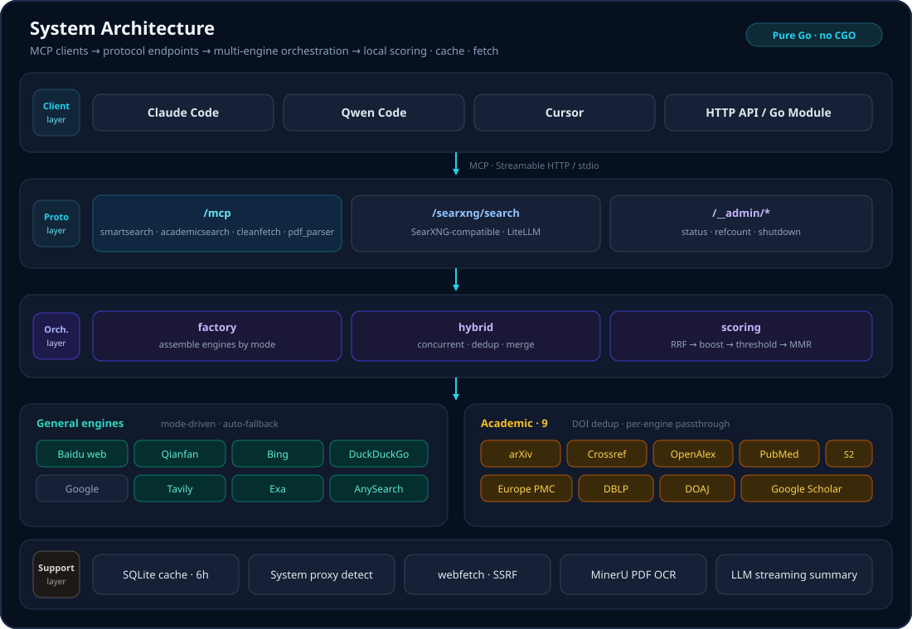

# Architecture & Design

[English](architecture.en.md) | [中文](architecture.md)

## Contents

- [Overall Architecture](#overall-architecture)
- [Fallback Chain](#fallback-chain)
- [System Proxy Auto-Detection](#system-proxy-auto-detection)
- [Caching](#caching)
- [Process Management & Reference Counting](#process-management--reference-counting)
- [Security](#security)
- [Embed as a Go Module](#embed-as-a-go-module)
- [Companion Extension: web-researcher](#companion-extension-web-researcher)

---

## Overall Architecture

<p align="center">
  
</p>

**Key design decisions**:

- **Single config source** — HTTP daemon and stdio CLI share the same YAML config (`pkg/config`); `mode` decides how the engine group is built
- **Engines as interfaces** — all engines implement the unified `SearchInf` interface; `pkg/search/factory.go` assembles them by mode; `HybridSearchImpl` handles multi-engine concurrent orchestration
- **Pure Go, no CGO** — SQLite via `modernc.org/sqlite`, single-binary deployment

---

## Fallback Chain

The system has built-in automatic fallback at multiple levels, so no single component failure affects overall availability:

| Level | Fallback Logic |
|-------|----------------|
| Provider key | `sk_list` multi-key rotation within a provider (duplicate keys deduplicated automatically); failed keys cool down for 30 min then auto-recover |
| Provider | `apipool` mode: current provider's SKs exhausted → switch to next provider (selection strategy round-robin / priority / weighted; weighted = weighted random by configured weight × available SK count) |
| Primary engine | Primary engine failure → auto-fallback to Bing |
| Baidu | Baidu SK failure → fallback to Baidu web search |
| Mode | Auto-degrades to `engine` mode when keys are missing |
| LLM summary | Streaming summary failure → non-streaming summary → raw results |
| Web fetch | go-webfetch failure → Jina Reader |
| Cache | Cache lookup error → skip cache and search directly |

---

## System Proxy Auto-Detection

Reads the Windows registry (`ProxyEnable` / `ProxyServer`) and environment variables (`HTTP_PROXY` / `HTTPS_PROXY`) by default. Once Clash, V2RayN, etc. enable the system proxy, it takes effect automatically — no manual `proxy.enabled` config or service restart needed.

- `pkg/proxy/sysproxy.go` — cross-platform system proxy detection (Windows registry + WinHTTP + env vars)
- `pkg/proxy/detector.go` — background polling detector, 30s cycle, notifies callbacks on proxy changes
- `pkg/proxy/proxy.go` — `DynamicProxyTransport` request-level dynamic proxy resolution, resolves the endpoint per request

**Behavior**:
- `proxy.enabled` unset → auto-detect system proxy
- `proxy.enabled: true` + `proxy.endpoint` → explicit proxy mode
- `proxy.enabled: false` → explicitly disable proxy

When a proxy is available, overseas services (DuckDuckGo, Semantic Scholar, Google Scholar, Jina Reader) automatically use it.

---

## Caching

- SQLite WAL mode, storage path via `cache.storage_path`
- 6h expiry (based on last hit), 30min scheduled cleanup
- Academic / non-academic results are keyed separately to prevent mixing
- `cache.enabled` explicit switch: unset → inferred from `storage_path` (backward compatible); explicit `false` → force disable; explicit `true` → force enable

---

## Process Management & Reference Counting

Multiple clients share one instance; the process exits gracefully when the reference count reaches zero:

- `start` → ref=1 or ref+1
- `stop` → ref-1, graceful exit at zero
- `kill` → force terminate (ignores reference count)
- `status` → show status, port, reference count

Combined with MCP Hooks (SessionStart / SessionEnd), sessions can auto-start/stop; multiple sessions share the instance and it exits when all close.

---

## Security

| Protection | Description |
|------------|-------------|
| SSRF protection | `cleanfetch` URL scheme validation, private-address blacklist |
| DNS rebinding detection | Resolves the target domain before fetching and checks all IPs for private/loopback addresses (double protection with go-webfetch's BlockPrivateIP) |
| HEAD pre-check | Checks Content-Length before fetching; rejects files over `max_fetch_size_mb` (default 10MB) |
| TLS fingerprint spoofing | go-webfetch uses tls-client Chrome 131 fingerprint for anti-bot |
| 429 rate-limit retry | All HTTP clients handle 429 automatically, reading the `Retry-After` header |
| arXiv rate-limit protection | Built-in 1 req/s limiter to avoid arXiv's official rate limit |

---

## Embed as a Go Module

```go
import ("websearch/pkg/config"; "websearch/server")

conf, _ := config.Load("config.yaml")
srv := server.New()
srv.SetRefCount(1)
srv.Run(*conf) // Full hosting

// Or get just the Handler to embed in an existing HTTP Server
handler := srv.Handler(*conf)
```

The `server` package offers two usage modes:

- **`Run(conf)`** — full startup: initializes engines, MCP routes, SearXNG routes, Admin routes, cache cleanup goroutine, starts the HTTP server and blocks until a signal or the reference count reaches zero
- **`Handler(conf)`** — initializes components and returns an `http.Handler` with all routes registered, without starting the HTTP server; ideal for embedding in an existing service (reuse port, TLS, middleware stack)

Full API docs: [api.md](api.md).

---

## Companion Extension: web-researcher

[web-researcher](https://github.com/daidaiJ/web-researcher) is a companion Qwen Code extension for websearch-mcpserver that offloads web research tasks from the main agent to a dedicated sub-agent, **keeping the main model's context window clean**.

### Why

The main model's context window in Qwen Code is precious. Directing the main agent to do web research — searching, fetching pages, filtering information — floods the context with raw content, squeezing out space for coding conversations.

web-researcher solves this: a dedicated fast model sub-agent (default `deepseek-v4-flash`) independently handles the full pipeline of search → filter → fetch → synthesize, generates a structured report saved locally, and returns only a concise summary to the main agent.

### Key Features

| Feature | Description |
|---------|-------------|
| 🔍 **Research Offloading** | `/research:search <query>` dispatches a research task; the sub-agent automatically decomposes queries, searches in parallel, filters, fetches, and generates a report |
| 📊 **Report Management** | `/research:reports` lists historical reports · `/research:read <keyword>` search and read reports by keyword |
| 📐 **Structured Reports** | Reports use `FINDING-*`, `DATA-*`, `CONFLICT-*` anchors; the main agent greps for specific sections on demand without loading the full report |

### Installation

In Qwen Code:

```bash
/extension-creator ~/.qwen/extensions/web-researcher
```

Then place the [web-researcher](https://github.com/daidaiJ/web-researcher) contents into that directory.

Or clone manually:

```bash
git clone https://github.com/daidaiJ/web-researcher.git ~/.qwen/extensions/web-researcher
```

### Usage

```
# One-click research
/research:search MCP protocol specification 2025

# Browse historical reports
/research:reports MCP

# Deep-dive on demand
/research:read MCP protocol
```

Reports are stored in `.qwen/research/` under the project directory and can be referenced across sessions.
