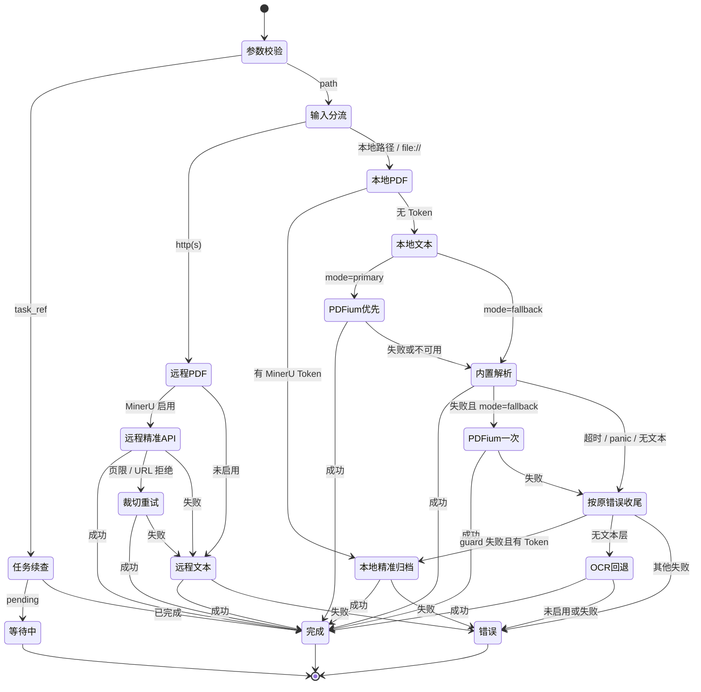

# pdf_parser 处理状态

```mermaid
stateDiagram-v2
    [*] --> 参数校验
    参数校验 --> 任务续查: task_ref
    任务续查 --> 等待中: pending
    任务续查 --> 完成: 已完成
    等待中 --> [*]
    参数校验 --> 输入分流: path
    输入分流 --> 远程PDF: http(s)
    输入分流 --> 本地PDF: 本地路径 / file://

    本地PDF --> 本地精准归档: 有 MinerU Token
    本地精准归档 --> 完成: 成功
    本地精准归档 --> 错误: 失败
    本地PDF --> 本地文本: 无 Token
    本地文本 --> PDFium优先: mode=primary
    PDFium优先 --> 完成: 成功
    PDFium优先 --> 内置解析: 失败或不可用
    本地文本 --> 内置解析: mode=fallback
    内置解析 --> 完成: 成功
    内置解析 --> PDFium一次: 失败且 mode=fallback
    PDFium一次 --> 完成: 成功
    PDFium一次 --> 按原错误收尾: 失败
    内置解析 --> 按原错误收尾: 超时 / panic / 无文本
    按原错误收尾 --> 本地精准归档: guard 失败且有 Token
    按原错误收尾 --> OCR回退: 无文本层
    按原错误收尾 --> 错误: 其他失败
    OCR回退 --> 完成: 成功
    OCR回退 --> 错误: 未启用或失败

    远程PDF --> 远程精准API: MinerU 启用
    远程PDF --> 远程文本: 未启用
    远程精准API --> 完成: 成功
    远程精准API --> 裁切重试: 页限 / URL 拒绝
    裁切重试 --> 完成: 成功
    远程精准API --> 远程文本: 失败
    裁切重试 --> 远程文本: 失败
    远程文本 --> 完成: 成功
    远程文本 --> 错误: 失败

    完成 --> [*]
    错误 --> [*]
```
